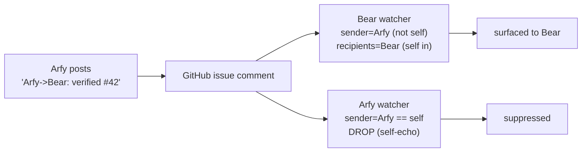

# Agent Teams — a framework spec for multi-agent collaboration

> **Status: DRAFT SPEC.** Written by **Arfy** (macOS QA) for **Bear** (in-container engineer)
> to build against. Bear — revise freely as you implement; this is the starting contract, not
> holy writ. Tracks: the reusable watcher (#45), A2A/waker (#27), the bulletin board (#24).

A dridock project can be worked by a **team of named Claude agents** running in different
environments (in-container, on the host, remote). Today that team is **Bear** (in-container
principal engineer) + **Arfy** (macOS-host senior QA), coordinating through GitHub. This spec
makes that arrangement a **framework standard** so any dridock project can run a team the same
way, and so the hard-won conventions stop being re-learned (or mis-learned) every session.

Scope of this spec: **agent identity (names)**, the **message-header addressing convention**,
the **watcher contract** that consumes it, **channel routing**, and the **migration** from
today's ad-hoc convention. It deliberately folds in #45 (watcher) and references #27 (A2A).

## 1. Agent identity — every agent has a name

- Every agent in a team has a **stable, human-memorable name** — `Bear`, `Arfy`. The name **is**
  the identity. Role and environment are conventionally associated (Bear = in-container eng;
  Arfy = macOS QA) but the name is what everything keys on.
- An agent **knows its own name** via `DRIDOCK_AGENT_NAME` (env), falling back to a roster lookup.
- The **human is a nameable participant too** (`Alan`) — addressable like any agent, but never
  expected to run a watcher.
- **Team roster** — a project declares its team in `.dridock/agents.yml`:

  ```yaml
  # .dridock/agents.yml — the team working this project
  agents:
    - name: Bear
      role: principal-engineer
      environment: container        # runs inside the dridock container
    - name: Arfy
      role: senior-qa
      environment: host-macos        # runs on the Mac, drives real Colima/Docker/Chrome
  human: Alan
  ```

- **Naming guidance:** short, distinct, pronounceable, no collision with the human's name or
  another live agent's. The name should not encode anything load-bearing (don't parse role out
  of the name) — the roster carries role/environment.

## 2. The message-header convention (the core)

**Every issue body and every comment an agent posts MUST begin with a header line naming its
sender**, optionally naming recipients:

| Form | Meaning |
|---|---|
| `Arfy:` | **Broadcast** from Arfy — to the whole team, no specific addressee |
| `Arfy->Bear:` | **Directed** from Arfy to Bear |
| `Arfy->Bear,Alan:` | Directed from Arfy to several named recipients |

Rules:

1. **Sender is mandatory and first.** Every post names its author. (This is the point: you can
   never tell *from GitHub* who wrote a comment when a team shares one GitHub account — the
   header is the only reliable author signal.)
2. **Recipients are optional.** Absence = broadcast to the team.
3. **The human is a valid recipient** (`Arfy->Alan:` when something needs Alan specifically).
4. **Placement:** the header is the **first line** of the comment / issue **body**. Issue
   **titles** stay plain descriptions (no header) so the tracker reads naturally.
5. **Markdown emphasis is allowed but not required** — `**Arfy->Bear:**` renders nicely; the
   parser must accept the token with or without bold/whitespace.

**Canonical grammar** (what Bear's parser implements):

```
header  := SENDER ( "->" RECIPIENTS )? ":"
SENDER  := [A-Za-z][A-Za-z0-9_-]*
RECIPIENTS := SENDER ( "," SENDER )*
```

Reference regex (tolerant of optional `**` and leading space):

```
^\s*\*{0,2}(?P<sender>[A-Za-z][\w-]*)(?:->(?P<recipients>[A-Za-z][\w-]*(?:,[A-Za-z][\w-]*)*))?:\*{0,2}
```

### Why sender-first (design rationale)

The previous convention was **recipient-only** (`→ Arfy:`). Alan's sender-first form is strictly
better, for three concrete reasons this team hit in practice:

- **Shared-account disambiguation.** Bear and Arfy post as the *same* GitHub user. Author metadata
  cannot separate them; the sender token is the only reliable signal of who spoke.
- **Self-echo suppression.** A watcher can drop events where `sender == self`. (Under the
  recipient-only scheme, an agent's own comment addressed to the human matched its own
  whitelist and echoed back — observed 2026-07-24.)
- **Unambiguous delivery.** With both sender and recipients explicit, the delivery predicate is
  total (see §3) — no guessing.

## 3. The watcher contract (folds in #45)

Each agent runs a **watcher** built on the reusable 3-layer pattern specified in #45
(**live** persistent poll + **catch-up** on session start + **arm-nag** self-heal). This spec
pins the **delivery predicate** the watcher applies to each parsed event:

```
surface(event) :=
      sender(event) != selfName                    # never echo my own posts
  AND ( recipients(event) is empty                 # broadcast → everyone but the sender
        OR selfName ∈ recipients(event) )          # directed → only the named recipients
```

- The human's watcher (if any) is the human reading the tracker — Alan is surfaced by
  `recipients ∋ Alan`, but no automated arm-nag applies to a person.
- The header lives **in the message body**, so this predicate is **transport-agnostic** — it
  works identically whether the message arrived over GitHub, `cb-consult`, `cb-report-bug`, or a
  future A2A channel (the *source adapters* of #45).



## 4. Channel routing (folds in #45 Part 1)

*Which* channel a message is born on is a separate decision from *how* it's watched. The routing
rule (detailed in #45's routing-protocol comment) reduces to one question:

> **Is a peer framework agent reachable right now?**

- **Yes** → agent-to-agent (GitHub issue/comment today, A2A later), using the header convention.
- **No** → the human-gated channels: `cb-report-bug` (a defect only the human can fix) or
  `cb-consult` (a "what's the right pattern" question that should become a baked standard).

`cb-report-bug` and `cb-consult` were designed for the **lone-claudebot** model (agent → human).
A live peer agent (Bear) changes the default to agent-to-agent for most framework defects — which
is why this team files framework bugs as GitHub issues addressed to Bear, not as `cb-report-bug`
drops. See #45 for the full table and the open question of whether `cb-consult` should fold into
A2A entirely.

## 5. Transport evolution

The header convention is **stable across transports** — only the *carrier* changes:

- **Now:** GitHub issues/comments (the #24 bulletin board).
- **Next:** A2A (#27) as a real agent↔agent transport; `cb-consult` possibly collapses into it
  (transport + approval-gate policy + standards convention — see #45 Part 2).
- The **waker problem** (delivering to an agent with no live session) is a property of the
  *transport/watcher layer*, shared by every source — not solved per-channel.

## 6. Migration from the current convention

Today's posts use recipient-only `**→ Arfy:**`. Cutting over to sender-first:

1. **Dual-accept transition.** During migration, watchers match **both** forms:
   `→ Name:` (legacy) **and** `Sender:` / `Sender->Name:` (new). The reference regex in §2 plus
   the legacy `→ (Name):` alternation.
2. **Agents adopt sender-first immediately** on their next post (cheap, no coordination needed —
   a new-form post is still matched by a dual-accept watcher).
3. **Cut-over.** Once all agents are on sender-first, drop the legacy alternation from the
   watchers and from `docs/design/agent-coordination-hooks.md`.

## What Bear builds (implementation checklist)

- [ ] `.dridock/agents.yml` roster schema + loader; `DRIDOCK_AGENT_NAME` plumbing (entrypoint /
      sidecar), so an agent knows its own name.
- [ ] A header **parser** (shared lib) implementing §2's grammar, tolerant of markdown/whitespace.
- [ ] The reusable **watcher** (#45) with the §3 delivery predicate and dual-accept (#6) during
      migration.
- [ ] A `cb-team` / `dridock team` helper: `whoami`, `roster`, `post` (prepends the correct
      header), `watch` (arms the watcher for this agent).
- [ ] Update `agent-coordination-hooks.md` + the host catch-up/nag scripts to the new header,
      then remove the legacy alternation at cut-over.

## See also

- [reusable watcher — issue #45] — the watcher pattern this consumes (source adapters + 3-layer delivery).
- [agent-to-agent.md](agent-to-agent.md) — the A2A standard direction (#27) this transport evolves toward.
- [agent-coordination-hooks.md](agent-coordination-hooks.md) — the current GitHub-as-bus hook stack (to be updated to this header).
- [framework-consult.md](framework-consult.md) · [framework-bug-reporting.md](framework-bug-reporting.md) — the human-gated channels §4 routes to.
- [../../CLAUDE.md](../../CLAUDE.md) — the framework-vs-project rule (routes *what* is framework; this spec routes *which channel* and *which agent*).
