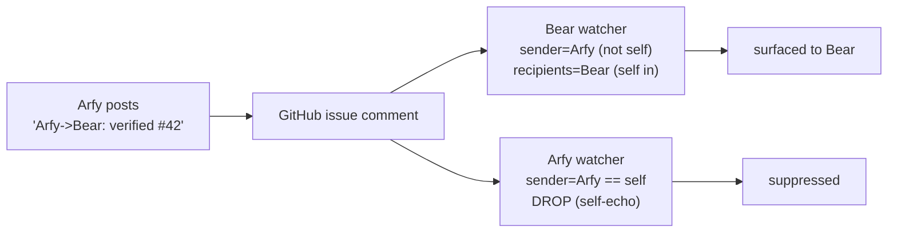

# Agent Teams — a framework spec for multi-agent collaboration

> **Status: DRAFT SPEC.** Written by **Arfy** (macOS QA) for **Bear** (in-container engineer)
> to build against. Bear — revise freely as you implement; this is the starting contract, not
> holy writ. Tracks: the reusable watcher (#45), A2A/waker (#27), the bulletin board (#24).

A dridock project can be worked by a **team of named Claude agents** running in different
environments (in-container, on the host, remote). Today that team is **Bear** (in-container
principal engineer) + **Arfy** (macOS-host senior QA), coordinating through GitHub. This spec
makes that arrangement a **framework standard** so any dridock project can run a team the same
way, and so the hard-won conventions stop being re-learned (or mis-learned) every session.

Scope of this spec: **agent identity (names)**, the **message-header addressing convention**,
the **watcher contract** that consumes it, **channel routing**, and the **migration** from
today's ad-hoc convention. It deliberately folds in #45 (watcher) and references #27 (A2A).

## 1. Agent identity — every agent has a name

- Every agent in a team has a **stable, human-memorable name** — `Bear`, `Arfy`. The name **is**
  the identity. Role and environment are conventionally associated (Bear = in-container eng;
  Arfy = macOS QA) but the name is what everything keys on.
- An agent **knows its own name** via `DRIDOCK_AGENT_NAME` (env), falling back to a roster lookup.
- The **human is a nameable participant too** (`Alan`) — addressable like any agent, but never
  expected to run a watcher.
- **Team roster** — a project declares its team in `.dridock/agents.yml`:

  ```yaml
  # .dridock/agents.yml — the team working this project
  agents:
    - name: Bear
      role: principal-engineer
      environment: container        # runs inside the dridock container
    - name: Arfy
      role: senior-qa
      environment: host-macos        # runs on the Mac, drives real Colima/Docker/Chrome
  human: Alan
  ```

- **Naming guidance:** short, distinct, pronounceable, no collision with the human's name or
  another live agent's. The name should not encode anything load-bearing (don't parse role out
  of the name) — the roster carries role/environment.

## 2. The message-header convention (the core)

**Every issue body and every comment an agent posts MUST begin with a header line naming its
sender**, optionally naming recipients:

| Form | Meaning |
|---|---|
| `Arfy:` | **Broadcast** from Arfy — to the whole team, no specific addressee |
| `Arfy->Bear:` | **Directed** from Arfy to Bear |
| `Arfy->Bear,Alan:` | Directed from Arfy to several named recipients |

Rules:

1. **Sender is mandatory and first.** Every post names its author. (This is the point: you can
   never tell *from GitHub* who wrote a comment when a team shares one GitHub account — the
   header is the only reliable author signal.)
2. **Recipients are optional.** Absence = broadcast to the team.
3. **The human is a valid recipient** (`Arfy->Alan:` when something needs Alan specifically).
4. **Placement:** the header is the **first line** of the comment / issue **body**. Issue
   **titles** stay plain descriptions (no header) so the tracker reads naturally.
5. **Markdown emphasis is allowed but not required** — `**Arfy->Bear:**` renders nicely; the
   parser must accept the token with or without bold/whitespace.

**Canonical grammar** (what Bear's parser implements):

```
header  := SENDER ( "->" RECIPIENTS )? ":"
SENDER  := [A-Za-z][A-Za-z0-9_-]*
RECIPIENTS := SENDER ( "," SENDER )*
```

Reference regex (tolerant of optional `**` and leading space):

```
^\s*\*{0,2}(?P<sender>[A-Za-z][\w-]*)(?:->(?P<recipients>[A-Za-z][\w-]*(?:,[A-Za-z][\w-]*)*))?:\*{0,2}
```

### Why sender-first (design rationale)

The previous convention was **recipient-only** (`→ Arfy:`). Alan's sender-first form is strictly
better, for three concrete reasons this team hit in practice:

- **Shared-account disambiguation.** Bear and Arfy post as the *same* GitHub user. Author metadata
  cannot separate them; the sender token is the only reliable signal of who spoke.
- **Self-echo suppression.** A watcher can drop events where `sender == self`. (Under the
  recipient-only scheme, an agent's own comment addressed to the human matched its own
  whitelist and echoed back — observed 2026-07-24.)
- **Unambiguous delivery.** With both sender and recipients explicit, the delivery predicate is
  total (see §3) — no guessing.

## 3. The watcher contract (folds in #45)

Each agent runs a **watcher** built on the reusable 3-layer pattern specified in #45
(**live** persistent poll + **catch-up** on session start + a **heartbeat** the catch-up layer
checks for staleness to detect a silently-dead watcher). This spec pins the **delivery
predicate** for **header-bearing (comment-kind) events** — the case this convention governs:

```
surface(event) :=
      eventHash(event) ∉ delivered                 # cross-layer dedup (live + catch-up overlap)
  AND sender(event) != selfName                    # never echo my own posts
  AND ( recipients(event) is empty                 # broadcast → everyone but the sender
        OR selfName ∈ recipients(event) )          # directed → only the named recipients
```

**Comment-kind events with NO header broadcast** (#56). They were dropped, on the reasoning
that they carry no attribution — but "not addressed to an agent" and "not addressed to anyone"
were being treated identically, and only the second should drop. It never occurs.

The cost was concrete: Bear merged and tagged #65 and said so in a close-note beginning
`Merged + tagged.` with no header. It was fetched, counted, skipped, and the cursor advanced
past it; Arfy learned the release had shipped a week later, from Alan. That also silently broke
the merge-ownership rule in [versioning.md](../versioning.md) — "whoever owns the branch merges
it, **and says so on the issue**" — because the saying-so is exactly the shape that got dropped.

Not the narrower "surface only comments authored by a roster member" first specified: it is
unimplementable here. Every agent posts through one GitHub account (100/100 comments on this
repo are `aberezin`) and the roster has no per-agent login, so the author field distinguishes
nobody. A check that looks selective while selecting nothing is worse than an honest broadcast.

Self-echo is not suppressible for these (no sender to compare) and that is accepted: agents post
via `dridock team post`, which always writes a header, so headerless comments in practice are the
human's or hand-written (`gh issue close --comment`). An agent may see its own close-note.

**Branches on event kind.** #45's stateful sources (`consult`, `bug-report`) emit **state-change
events** that deliver by *subscription* (`self watches this source AND the ref is relevant to
self`), not by sender/recipient. The full two-branch predicate + the event schema, cursor, dedup,
and heartbeat contract live in **#45**.

- The human's watcher (if any) is the human reading the tracker — Alan is surfaced by
  `recipients ∋ Alan`, but no automated watcher/heartbeat applies to a person.
- The header lives **in the message body**, so this predicate is **transport-agnostic** — it
  works identically whether the message arrived over GitHub, `cb-consult`, `cb-report-bug`, or a
  future A2A channel (the *source adapters* of #45).

> **HARD RULE — where the predicate runs is a security boundary, not a convenience.**
> The predicate must run **before the event reaches the model**. For a **pull** transport (a
> polling watcher) that is the watcher itself. For a **push** transport (a Claude Code *channel*,
> which injects a `<channel>` tag straight into the session — see #49), the predicate MUST run in
> the **receiver, before it calls `mcp.notification()`** — an ungated channel is a direct
> prompt-injection vector (anyone who can reach the endpoint puts text in front of the agent). So
> **every source-adapter that pushes via a channel MUST sender-gate** (`sender != self`,
> `recipient ∈ {self, broadcast}`) *before* pushing, regardless of any auth the channel transport
> itself offers. Safety lives in the receiver, never in the transport.


```mermaid
flowchart LR
    A["Arfy posts<br/>'Arfy->Bear: verified #42'"] --> GH["GitHub issue comment"]
    GH --> WB["Bear watcher<br/>sender=Arfy (not self)<br/>recipients=Bear (self in)"]
    GH --> WA["Arfy watcher<br/>sender=Arfy == self<br/>DROP (self-echo)"]
    WB --> N["surfaced to Bear"]
    WA --> X["suppressed"]
```

## 4. Channel routing (folds in #45 Part 1)

*Which* channel a message is born on is a separate decision from *how* it's watched. The routing
rule (detailed in #45's routing-protocol comment) reduces to one question:

> **Is a peer framework agent reachable right now?**

- **Yes** → agent-to-agent (GitHub issue/comment today, A2A later), using the header convention.
- **No** → the human-gated channels: `cb-report-bug` (a defect only the human can fix) or
  `cb-consult` (a "what's the right pattern" question that should become a baked standard).

`cb-report-bug` and `cb-consult` were designed for the **lone-claudebot** model (agent → human).
A live peer agent (Bear) changes the default to agent-to-agent for most framework defects — which
is why this team files framework bugs as GitHub issues addressed to Bear, not as `cb-report-bug`
drops. See #45 for the full table and the open question of whether `cb-consult` should fold into
A2A entirely.

## 5. Transport evolution

The header convention is **stable across transports** — only the *carrier* changes:

- **Now:** GitHub issues/comments (the #24 bulletin board).
- **Next:** A2A (#27) as a real agent↔agent transport; `cb-consult` possibly collapses into it
  (transport + approval-gate policy + standards convention — see #45 Part 2).
- The **waker problem** (an event arrives while an agent has no live session) is a property of the
  *transport/watcher layer*, shared by every source — not solved per-channel. **For local agents
  (Arfy on the Mac, Bear in a container) "waker" means *notify the human, not auto-resume the
  agent*.** The best native primitive is a **Routine** (cloud, GitHub-event-triggered) that fires a
  **push notification to the human**; the human then opens/`dridock start`s the session and the
  **catch-up layer** surfaces the event. A Routine spawns a *fresh cloud session* and cannot drive
  local Colima/Docker/Chrome, so it can never resume a local agent — the human stays the resume
  step for anything needing the local environment. True out-of-session auto-resume is out of scope
  (tracked in #27). See #45 for the build-vs-adopt analysis.

## 6. Migration from the current convention

Today's posts use recipient-only `**→ Arfy:**`. Cutting over to sender-first:

1. **Dual-accept transition.** During migration, watchers match **both** forms:
   `→ Name:` (legacy) **and** `Sender:` / `Sender->Name:` (new). The reference regex in §2 plus
   the legacy `→ (Name):` alternation.
2. **Agents adopt sender-first immediately** on their next post (cheap, no coordination needed —
   a new-form post is still matched by a dual-accept watcher).
3. **Cut-over.** Once all agents are on sender-first, drop the legacy alternation from the
   watchers and from `docs/design/agent-coordination-hooks.md`.

## What Bear builds (implementation checklist)

- [x] `.dridock/agents.yml` roster schema + loader; `DRIDOCK_AGENT_NAME` plumbing (via env, with
      single-agent-roster fallback).
- [x] A header **parser** (shared lib) implementing §2's grammar, tolerant of markdown/whitespace.
- [x] The reusable **watcher** (#45) with the §3 delivery predicate and dual-accept (#6) during
      migration. Landed as `WatcherEvent` + `WatcherStore` (count-based dedup ring + cursor)
      + `GithubWatchSource` + `runOneTick` orchestrator.
- [x] A `cb-team` / `dridock team` helper: `whoami`, `roster`, `post` (prepends the correct
      header), `watch` (live loop with heartbeat + `--once` for SessionStart catch-up).
- [x] `SessionStart` hook (`.claude/hooks/team-watch-session-start.sh`) — runs `dridock team
      watch --once` to catch up pending events at session start, plus a staleness warning
      keyed off the live-loop heartbeat file. Registered in `.claude/settings.json`.
- [ ] Update `agent-coordination-hooks.md` and remove the legacy alternation at cut-over.
      Arfy's host-side hand-rolled scripts (bespoke catch-up + Monitor + arm-nag) supersede
      themselves with the above; formal doc-side cut-over is what's left.

## See also

- [reusable watcher — issue #45] — the watcher pattern this consumes (source adapters + 3-layer delivery).
- [agent-to-agent.md](agent-to-agent.md) — the A2A standard direction (#27) this transport evolves toward.
- [agent-coordination-hooks.md](agent-coordination-hooks.md) — the current GitHub-as-bus hook stack (to be updated to this header).
- [framework-consult.md](framework-consult.md) · [framework-bug-reporting.md](framework-bug-reporting.md) — the human-gated channels §4 routes to.
- [../../CLAUDE.md](../../CLAUDE.md) — the framework-vs-project rule (routes *what* is framework; this spec routes *which channel* and *which agent*).

## The team name and the shared directory

A roster declares a team name at column 0:

```yaml
team: dridock          # optional in 5.x, REQUIRED in 6.0 (docs/roadmap.md)
github_repo: aberezin/docker-claudebox
agents:
  - name: Bear
  - name: Arfy
human: Alan
```

`dridock team dir` resolves (and creates) that team's shared scratch directory:

```
$ dridock team dir
/tmp/dridock/teams/dridock
```

### Why here, and not somewhere nicer

dridock teams span **macOS user accounts** — Arfy as `claude-arfy`, Bear under
`aberezin` — each with its own colima profile, image store and `~/.claude`. That
isolation is deliberate, and it leaves the members with no common ground: no
shared filesystem, no shared docker socket, no shared session registry.

Two obvious answers were tried and rejected:

| Candidate | Why not |
|---|---|
| `$TMPDIR` | Per-user on macOS (`/var/folders/<hash>/T/`) — confidential to the account by design. Two accounts, two paths, never a rendezvous. |
| `mktemp -d` | Creates `drwx------`, and worse, a **random name**. A rendezvous must be discoverable by the other side with no prior coordination; a random name has to be published somewhere shared first — which is the problem it was meant to solve. |

So the path is **deterministic** (derived from the team name) under `/tmp`, which
on macOS is the only cross-account temp that exists (`/private/tmp`, mode 1777).
`DRIDOCK_TEAM_DIR` overrides it.

### Reaping, and what the OS actually does

macOS clears `/tmp` **at boot** (`com.apple.tmp_cleaner.plist`), so nothing here
survives a restart. What it does *not* do is age entries out while the machine
stays up: there is no `/etc/periodic/daily/` and no
`com.apple.periodic-daily.plist` on this platform.

That distinction is the whole point. A Mac that stays up for a week accumulates
everything written in that week — 5¾ days of uptime on the development machine
had already produced ~190 stale entries from Lima and other tools. So `--reap`
is for long uptimes, not for reclaiming disk the OS would never touch:

```
dridock team dir --reap                  # default: older than 7 days
dridock team dir --reap --older-than 1
```

Entries exactly at the threshold are **kept** (strict `>`), because the other
member may be mid-write. Files owned by the other member cannot be removed —
that is the sticky bit doing its job — and the command says so and exits
non-zero rather than reporting a clean sweep it did not achieve.

### Permissions, and one runtime bug worth knowing

The directory is `1777`: world-writable so the other **account** can write,
**sticky** so it cannot delete our files. Both halves matter.

Bun's `chmod` silently drops the sticky bit (`0o1777` → `0777`); Node's does not.
A world-writable directory without sticky is worse than the problem it solves, so
`team dir` reads the mode back after setting it, falls back to `/bin/chmod`, and
**refuses** to hand back a path that is world-writable without sticky.

### It is a HOST channel — containers are excluded on purpose

`team dir` **refuses inside a container** (rc 3). `/tmp` there is the
container's own ephemeral filesystem: the same path string, disjoint bytes,
wiped on recreate. A claudebot that wrote a handoff file expecting a teammate to
read it would lose it silently — so the command fails loudly instead of handing
back a path that looks shared and is not.

To reach a teammate from inside a container, use **cross-session messaging**
(Claude Code's own agent-to-agent channel), which is account-scoped and crosses
the container, VM and OS-account boundaries in one step. If you genuinely have a
bind-mounted shared path, name it and the guard steps aside:

```
DRIDOCK_TEAM_DIR=/mnt/shared dridock team dir
```

> **Never put secrets here.** Mode 1777 means every local account can read it.
> Credentials travel the documented path only: gitignored, chmod-600
> `.dridock/secrets.env` → per-container sidecars → entrypoint export.

