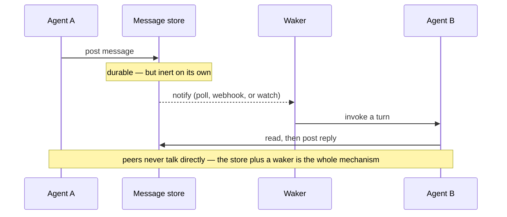

# Agent-to-agent communication — the standard dridock adopts

Which wire protocol dridock-spawned agents use to talk to **each other** (as opposed to
their tools), why it is **A2A**, and what has to exist in the harness before that choice
buys anything.

## Summary

| Question | Answer |
|---|---|
| Standard for agent↔**tool** | **MCP** — already implemented (`api_server.py` mounts FastMCP at `/mcp`). |
| Standard for agent↔**agent** | **A2A** (Agent2Agent), Linux Foundation, v1.0 April 2026. |
| Is there a live competitor? | No. **ACP folded into A2A** in August 2025; its team wound down and contributed upstream. |
| Does adopting A2A fix agent↔agent latency today? | **No.** See [The waker problem](#the-waker-problem) — it is a separate, prior problem. |
| How much of A2A does dridock already have? | Most of the hard part. See [Why dridock is well-positioned](#why-dridock-is-well-positioned). |

## Why A2A and not something else

The three protocols people compare are not alternatives — they sit at different layers,
and only one of them is about peers:

| Protocol | Connects | Status for dridock |
|---|---|---|
| **MCP** (Model Context Protocol) | an agent → its tools | **In use.** `_mcp = FastMCP(...)` (`api_server.py`), mounted with bearer auth at `/mcp`. Keep. |
| **A2A** (Agent2Agent) | an agent → another agent | **Adopt.** v1.0, Linux Foundation, SDKs in Python/JS/Java/Go/.NET. |
| **ACP** (Agent Communication Protocol) | an agent → another agent | **Dead as a separate thing.** Merged into A2A; do not build against it. |

A2A's two primitives are the ones we actually need:

- **Agent Card** — a machine-readable description of an agent's capabilities, input/output
  modalities, and auth requirements, published at a well-known URL. This is *discovery*:
  it is how a claudebot in Project-A learns what a claudebot in Project-B can do without
  a human wiring them together.
- **Task lifecycle** — submit, stream progress, complete/fail, with webhook push for
  long-running work.

Rolling our own envelope format buys nothing and costs interop with the 150+
organizations already on A2A.

## The waker problem

**Adopting A2A will not, by itself, make Bear↔Arfy (or Project-A↔Project-B) faster.**

The current bottleneck is not the message format. It is that **an agent session does not
act until something gives it a turn.** A GitHub issue, a file drop, and an A2A task POST
are all equally inert if nothing invokes the agent process afterward.

This is worth stating plainly because it is the failure mode of adopting a protocol for
its own sake: you get a better envelope and identical latency.



The **waker** is the load-bearing component. Any transport works once it exists; no
transport works until it does. Solve it first, independently of protocol choice.

## Why dridock is well-positioned

The harness already contains most of what an A2A server needs — this is the reason the
adoption is cheap rather than speculative:

| A2A needs | dridock already has |
|---|---|
| An HTTP surface with auth | `api_server.py` — FastAPI with bearer auth (`DRIDOCK_MODE_API_TOKEN`). |
| A task submit endpoint | `POST /run` — takes a prompt, runs `claude` in a resolved workspace, returns the result. |
| Async task handling | `POST /run` async via run-id, `GET /run/result`, `POST /run/cancel`. |
| Concurrency control | One active run per workspace (concurrent → 409). |
| A stable, collision-free address per agent | The per-project VM IP — see [per-project-vm.md](per-project-vm.md). |
| A network for sibling agents | `cb-net` — see [n-tier-networking.md](n-tier-networking.md). |
| A process that *invokes an agent on request* | The API server itself. **This is the waker.** |

`POST /run` is already an A2A task in everything but its envelope. The work is to add an
Agent Card and map the A2A task shape onto the existing run lifecycle — not to build a
new service.

## Proposed shape

Additive to the existing API mode. No new daemon, no new container role.

```
GET  /.well-known/agent-card.json   # discovery: capabilities, modalities, auth scheme
POST /a2a/v1/tasks                  # submit — maps onto the existing /run lifecycle
GET  /a2a/v1/tasks/{id}             # poll   — maps onto /run/result
POST /a2a/v1/tasks/{id}/cancel      # cancel — maps onto /run/cancel
```

Reuses the existing bearer-token auth and workspace isolation unchanged. The Agent Card
is generated per project so a claudebot advertises the profiles and `cb-*` helpers it
actually has, rather than a static list.

## Non-goals

- **Replacing MCP.** MCP stays the tool layer. An agent uses A2A to delegate to a peer
  and MCP to reach its own tools; they compose, they do not compete.
- **Cross-organization federation.** Signed Agent Cards and cross-vendor trust are real
  A2A features, but out of scope until the single-machine case works.
- **A bespoke message bus.** The harness already carries two message stores (the
  `framework-consult` store, and GitHub issues for inter-agent coordination). A third
  hand-rolled one is cost without a standard's payoff.

## Sequencing

1. **Waker first.** Independent of protocol. Until an inbound message can invoke a turn,
   nothing else matters.
2. **Agent Card + task endpoints** on `api_server.py`, behind the existing auth.
3. **Discovery across projects** over `cb-net` / VM IPs, so a claudebot can find peers
   without hardcoded addresses.

Steps 2 and 3 are host↔image contract changes (new forwarded env, new endpoints) and
bump `VERSION` per [versioning.md](../versioning.md). This doc alone does not.

## See also

- [n-tier-networking.md](n-tier-networking.md) — addressing and binding rules that any A2A endpoint must follow.
- [per-project-vm.md](per-project-vm.md) — the per-project VM IP that gives each agent a stable address.
- [framework-consult.md](framework-consult.md) — the existing file-based agent↔human message store, and a worked Mermaid sequence example.
- [../modes/api.md](../modes/api.md) — the API mode this would extend.
- [backends.md](backends.md) — backend-awareness constraints for anything that assumes Colima.
- [../documentation.md](../documentation.md) — house style for this doc set.
