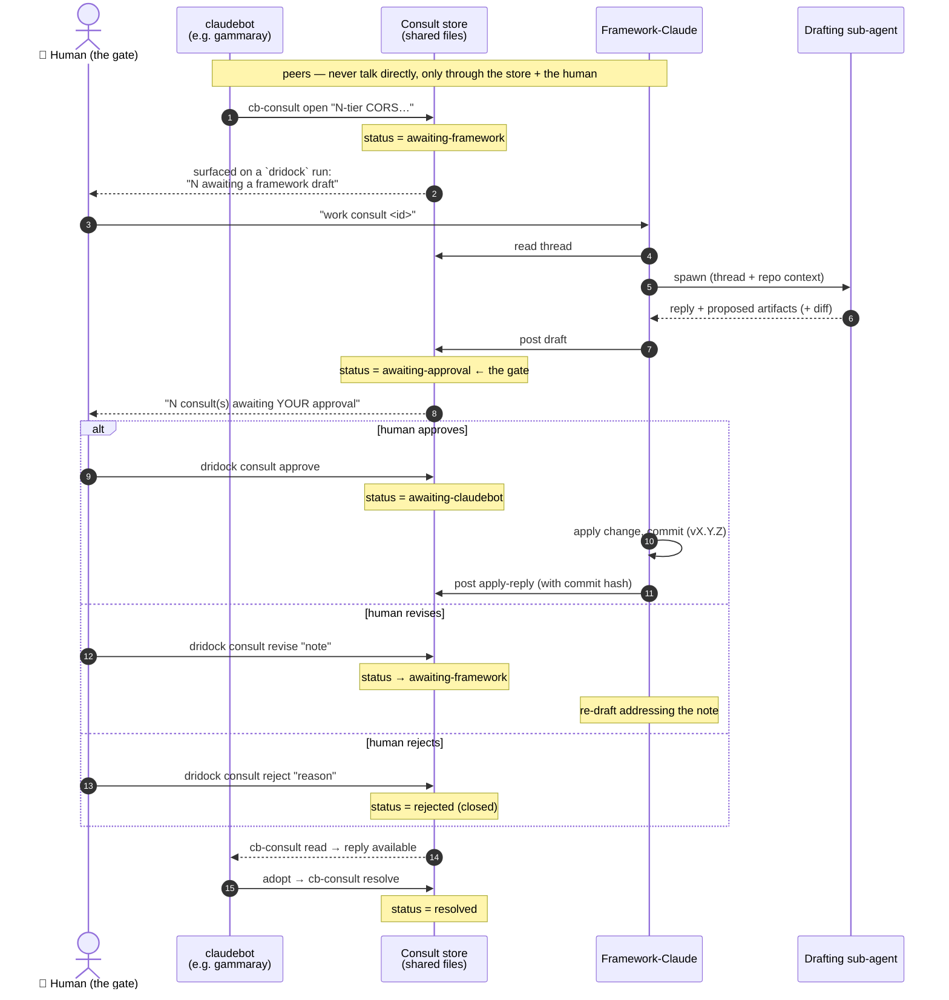

# Framework consult — supervised claudebot ↔ framework-Claude collaboration

A **consult** is a supervised conversation between a **claudebot** (a Claude building an
app inside a project container) and **framework-Claude** (a Claude working on *this*
harness repo on the Mac), mediated by a shared file substrate and gated by **you**. Its
purpose: when a claudebot hits a problem that is really about the *harness/environment*
and would **recur in any dridock project**, it escalates — and the resolution becomes a
**baked-in dridock best practice** instead of something every project re-derives.

The motivating case: the localhost-vs-VM-IP / CORS tangle in N-tier app dev. That is not
one project's bug; it is an *N-tier-under-dridock* problem. See the worked example that
produced [n-tier-networking.md](n-tier-networking.md).

## Topology — peers, not parent/child

The claudebot and framework-Claude are **independent peers**. The claudebot is a full
Claude Code process in its own container/VM, launched by the human via `dridock`, with
its own lifecycle (it can run under cron/Telegram/API with no framework-Claude present).
It is **not** a sub-agent of framework-Claude; neither owns the other's lifecycle. The
consult channel connects them through durable files + the human — never an in-memory
spawn link. "Framework-Claude" is a **role**, fulfilled by whatever Claude session you
point at this repo; a thread survives with zero framework-Claude sessions open and is
picked up later by id.

The only sub-agent in the system is on the framework side: when drafting a reply,
framework-Claude spawns an **Agent-tool drafting sub-agent** (§ Hybrid auto-draft). That
sub-agent is a child of framework-Claude — the *app-building claudebot never is*.

## Substrate

A shared host dir, sibling to the framework-bugs drop:

    $(cb_config_home)/dridock/consult/            # = ~/.config/dridock/consult
      <thread-id>/
        meta                 # KEY=VALUE: id, project, title, status, created, updated, [layer], [commit]
        001-claudebot.md     # turns, numbered, author ∈ claudebot|framework|human
        002-framework.md
        003-human.md
        proposed.diff        # optional: the drafting sub-agent's proposed harness patch

It is bind-mounted into **every** container at `/home/claude/framework-consult` and the
path is exposed as `DRIDOCK_CONSULT_DIR` — exactly the framework-bugs pattern. All files;
fully auditable (you can just `cat` a thread); no network surface; works offline. This is
the same file-IPC ethos as the auth/secrets/`-cdp`/`-vmip` sidecars.

**Thread id**: `<YYYYMMDD-HHMMSS>-<project-short-id>` — unique, sortable, and it names the
originating project. **Concurrency** is free: many claudebots → many thread dirs; each is
independent; you approve them one at a time.

## State machine

    awaiting-framework   claudebot opened/replied; framework-Claude should draft
      → awaiting-approval framework-Claude drafted (reply + optional proposed.diff); YOU gate
        → awaiting-claudebot  you approved & the change was applied; reply is visible to claudebot
          → resolved      claudebot read & adopted (or you closed it)
    (awaiting-approval → awaiting-framework)  you bounced it back with a revision note
    (any → rejected)                          you closed it without action

Nothing reaches the claudebot until it is `awaiting-claudebot` — i.e. until **you**
approved. That is the supervision guarantee.

## Actors & verbs

**claudebot** (in-container, `cb-consult`):
- `cb-consult open "<title>" [--layer L]`  — body via stdin/heredoc → new thread (`awaiting-framework`)
- `cb-consult say <id>`                     — body via stdin → append a claudebot turn (`awaiting-framework`)
- `cb-consult read <id>`                    — print the thread (esp. framework replies)
- `cb-consult list`                         — this project's threads + status
- `cb-consult resolve <id> [note]`          — mark adopted (`resolved`)

**you** (host, `dridock consult`):
- `dridock consult list [--json]`         — all threads across all projects + status
- `dridock consult show <id>`             — full thread + proposed.diff
- `dridock consult approve <id>`          — gate: `awaiting-approval` → `awaiting-claudebot` (framework-Claude then applies + replies)
- `dridock consult revise <id> [note]`    — bounce back: `awaiting-approval` → `awaiting-framework`
- `dridock consult reject <id> [reason]`  — close without action
- `dridock consult post <id> …`           — low-level append used by framework-Claude/you (author, status, attach diff)

A normal `dridock` run surfaces pending work the same way `checkversion` warns:
`⚠ N framework consult(s) awaiting your approval` / `… awaiting a framework draft`.

**framework-Claude** (this repo; the [`framework-consult` skill](../../.claude/skills/framework-consult/SKILL.md)):
drives the loop below.

## Hybrid auto-draft flow

1. claudebot `cb-consult open` → thread `awaiting-framework`.
2. You bring it into a framework-Claude session (a `dridock` run surfaced it; you say
   "work consult `<id>`"). Framework-Claude reads the thread.
3. Framework-Claude **spawns an Agent-tool drafting sub-agent** with the thread + this
   repo's code/docs/baked guidance. It returns a structured draft: a **reply**, a
   **proposed resolution** (which harness artifact(s) to change — a doc/`cb-*`
   helper/baked-guidance edit/new env — and *why it generalizes*), and optionally a
   **`proposed.diff`**. Framework-Claude writes the draft and sets `awaiting-approval`.
   **It is not sent to the claudebot.**
4. You **review** (`dridock consult show <id>`) and `approve` / `revise` / `reject`.
   For hard ones you skip the auto-draft and reason it out with framework-Claude directly.
5. On `approve` → framework-Claude **applies** the change in the harness (edit + `make
   build` if needed + semver bump + CHANGELOG), commits, posts the reply *with the commit
   hash*, sets `awaiting-claudebot`.
6. claudebot `cb-consult read` → adopts it, `cb-consult resolve`. Because the fix also
   lands in **baked guidance/docs**, *every future claudebot inherits it* — that
   propagation, not the single answer, is the payoff.

"Hybrid" = the drafting is automated (the sub-agent, not you, writes the analysis) but
**held for your approval** before it returns to the claudebot.

### Sequence

The claudebot and framework-Claude **never talk directly** — every arrow to/from the
store is a file read/write, and the human is the only actor that advances the gate.

## Staying alerted (surfacing + watch)

Acting on a consult needs a **live** session (both framework-Claude and a claudebot are
sessions), so there are two alerting layers:

- **(A) Startup surfacing** — cheap, fires at session boot. A host `dridock` run prints
  `🗣 N consult(s) awaiting YOUR approval / a framework draft`; the entrypoint injects an
  equivalent note into the **claudebot's** startup context when one of its threads is
  `awaiting-claudebot` (an approved reply is waiting). On the **framework-Claude side**, a
  `SessionStart` hook (`.claude/hooks/consult-session-start.sh`, wired in
  `.claude/settings.json`) surfaces pending consults and — if no watcher is running —
  nudges the session to launch `dridock consult watch`. **In-container framework-dev
  variant (2.16.0):** for a claudebot whose workspace **is** a dridock harness fork (auto-
  detected by `wrapper.sh` containing `DRIDOCK_VERSION=`; override
  `DRIDOCK_FRAMEWORK_DEV=1`), the entrypoint also injects a note listing every
  `awaiting-framework` consult **across all projects** plus every unreviewed framework-bug
  report — the same surface the host wrapper gives, mirrored for a session that has no host
  wrapper. Use `cb-consult list --all` and `cb-report-bug list` from inside. So a session
  *starts* aware.
- **(B) `watch` — block until change, mid-session.** `dridock consult watch` (host) and
  `cb-consult watch` (container) are **token-free** loops that block until a relevant
  thread changes state (a new consult / a reply landing / a new turn), print what changed,
  and **exit**. Run as a **background task** in a live session: the harness re-invokes the
  session when the task exits, it handles the change, then relaunches the watcher. Pure
  files + polling — no external infra; it costs nothing until an actual change. Default
  poll interval 20s (`watch [secs]`); swap in `inotifywait`/`fswatch` later if you want
  event-driven.

Neither can wake a session that isn't running — that's inherent. When nobody's watching,
the party to alert is the **human** (so you open a session); a push hook (Telegram/
desktop) on a state change is the complementary path, not yet built.

## When to open a consult (escalation criteria)

Baked into the container `CLAUDE.md` so a claudebot knows the boundary. Open one only when
**all** hold:
- The problem is about the **harness/environment** (wrapper, entrypoint, image, Colima/
  Docker networking, the `cb-*` tooling), not your app's own logic.
- It would **recur in any dridock project** — it's a general engineering concern, not
  project-specific.
- It is **not already covered** by the baked guidance / docs.

The baked guidance now leads with an explicit **framework-vs-project check** (does the
rule name any project-owned code/schema/service? if no, it's framework) so the claudebot
makes the routing decision *at the moment of writing a rule down*, not after the rule
has already leaked into a project's `CLAUDE.md`.

Otherwise: solve it locally (your app's own work), or — if it's a concrete defect rather
than a "what's the right pattern" question — file it with `cb-report-bug`. A consult may
cite a bug report. Consults are the *bidirectional, best-practice-seeking* sibling of the
one-way `cb-report-bug` drop.

## Design choices & non-goals

- **No headless auto-relay in v1.** The drafter is an Agent-tool sub-agent of a live
  framework-Claude session, not a bash daemon spawning Claude — so a `dridock consult
  watch` daemon that answers on its own is explicitly out of scope (a possible phase 2).
  The bash layer only handles the substrate, surfacing, and your gates.
- **Human is always the gate.** No draft reaches a claudebot without `approve`.
- **Every resolution must produce a durable artifact.** A consult that ends in only a
  chat reply is incomplete — the point is to change the framework and/or its baked
  guidance so the lesson propagates.

## See also

- [n-tier-networking.md](n-tier-networking.md) — the first standard this channel produced (the worked example).
- [browser-testing.md](browser-testing.md) — where the motivating localhost/IP/CORS pain surfaced.
- [convenience-scripts.md](convenience-scripts.md) — the `cb-*` container-helper convention (`cb-consult`, `cb-report-bug`).
- [../../CLAUDE.md](../../CLAUDE.md) — the multi-project DooD vision this enforces a common standard across.
