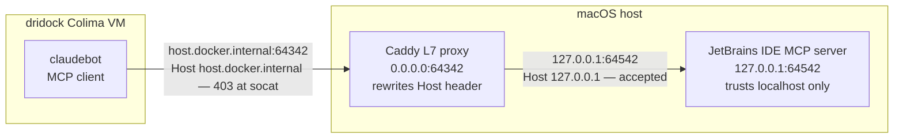

# Reaching a host MCP server from a claudebot (IDE MCP servers, the DNS-rebinding 403)

A common wiring: the claudebot runs **inside** a dridock container, but the MCP server
it should talk to runs on the **Mac host** — most often a JetBrains IDE's built-in MCP
server (IntelliJ / WebStorm / PyCharm expose one, identified by the
`IJ_MCP_SERVER_PROJECT_PATH` header). This page documents the one non-obvious trap in
that setup — a `403 Forbidden` that *looks* like an auth/OAuth failure but is really a
`Host`-header rejection — and the standard fix: a small **L7 Host-rewrite proxy**, not
`socat`.

## The two networking facts that collide

1. **The container reaches the host as `host.docker.internal`.** Inside a dridock
   container, the Mac host is not `localhost` (that's the container) — it's
   `host.docker.internal`. So the MCP config points there:
   `"url": "http://host.docker.internal:64342/sse"`.

2. **IDE MCP servers bind `127.0.0.1` only, and only trust a localhost `Host`.** The
   JetBrains built-in web server listens on loopback and has **DNS-rebinding
   protection**: it serves a request only if its `Host` header is `localhost` /
   `127.0.0.1`, and returns **`403 Forbidden`** (empty body) for any other `Host`. This
   is a deliberate browser-security feature, not a bug.

Because the server is loopback-only, you need a forwarder on an interface the container
can reach (`0.0.0.0`). The obvious choice — `socat` — is where it goes wrong.

## Why `socat` doesn't work (and the symptom it produces)

`socat TCP-LISTEN:64342,bind=0.0.0.0,fork,reuseaddr TCP:127.0.0.1:64542` forwards the
bytes, but it is **L4 (raw TCP)**: it never touches the HTTP `Host` header. So the
container's `Host: host.docker.internal:64342` arrives at the IDE unchanged, and the IDE
**403s it**.

The confusing part is what Claude Code does *next*. It reads the 403 as "maybe I need to
authenticate," and kicks off an OAuth 2.0 **Dynamic Client Registration** attempt —
`POST /register` (RFC 7591) — which the IDE *also* 403s (same `Host` reason). The result
looks exactly like an OAuth handshake failure:

```
POST /register HTTP/1.1
Host: host.docker.internal:64342
{"client_name":"Claude Code (...)","redirect_uris":["http://localhost:.../callback"],...}
→ HTTP/1.1 403 Forbidden
```

It is a red herring. **There is no OAuth here** — the IDE has no `/register` endpoint
(it's `404` from localhost) and no OAuth discovery docs. The single root cause is the
`Host` header.

### One-line diagnosis

Curl the server twice, changing *only* the `Host` header:

```bash
# what the container sends → rejected
curl -sS -o /dev/null -w '%{http_code}\n' -H 'Host: host.docker.internal:64342' http://127.0.0.1:64542/sse
#   → 403

# a trusted Host → served (SSE stream stays open; curl "times out" = success)
curl -sS      --max-time 3   -H 'Host: 127.0.0.1:64542'          http://127.0.0.1:64542/sse
#   → event: endpoint / data: /message?sessionId=...
```

If the only difference between 403 and a live SSE stream is the `Host` header, you have
this problem.

## The fix: an L7 Host-rewrite proxy

Replace `socat` with a tiny **L7 reverse proxy** that rewrites `Host` to the backend's
`127.0.0.1:<port>` on every request, then forwards. It listens on the same
container-reachable bind `socat` used, so nothing else changes. **Caddy** is a good fit —
single static binary, one-line reverse proxy, and it streams SSE natively (with nginx you
must remember `proxy_buffering off`).

`Caddyfile`:

```caddyfile
{
	auto_https off       # plain HTTP on a custom port, no TLS
	admin off            # don't expose Caddy's admin API (:2019)
}

:64342 {
	reverse_proxy 127.0.0.1:64542 {
		header_up Host 127.0.0.1:64542   # the rewrite that clears the 403
		flush_interval -1                # stream SSE immediately (no buffering)
	}
}
```

Run it (stop the `socat` on that port first, or Caddy can't bind):

```bash
kill "$(pgrep -f 'TCP-LISTEN:64342')"          # free the port
caddy run --config ./gammaray-mcp.Caddyfile    # or: sudo port load caddy  (launchd)
```

Verify — the bad `Host` now returns a stream, not a 403:

```bash
curl -sS -i --max-time 3 -H 'Host: host.docker.internal:64342' http://127.0.0.1:64342/sse | head
```

Reconnect the MCP server in the container and the OAuth `/register` flailing disappears
entirely — there's no 403 for Claude Code to misread as an auth challenge.



### Alternative: widen the IDE's trusted hosts

Some JetBrains versions expose a Registry key
`ide.built.in.web.server.allowed.hosts` (Help → Find Action → Registry) — adding
`host.docker.internal` there whitelists the container's `Host` directly, no proxy needed.
The key isn't present in every IDE version, so the Host-rewrite proxy is the portable
fix.

## Note: which project the server lands under

`dridock mcp add` uses **local (project) scope** by default, so the server is written
under the *current working directory's* key in `.claude.json`. It only appears to a
claudebot whose workspace matches that key. If a freshly-added server doesn't show up,
confirm it was keyed under the real workspace path (not the image's default `WORKDIR`) —
see the MCP-add flow in [../customization.md](../customization.md#mcp-servers).

## See also

- [../customization.md](../customization.md#mcp-servers) — declaring MCP servers (scopes, file format, `dridock mcp add`).
- [n-tier-networking.md](n-tier-networking.md) — the broader container↔host / service↔service addressing model (`host.docker.internal`, the rotating VM IP, `cb-net`).
- [per-project-vm.md](per-project-vm.md) — the per-project Colima VM the container runs in.
- [browser-testing.md](browser-testing.md) — the other host-bridge pattern (CDP to your real Chrome), which faces the same "reach the Mac from the VM" addressing.
