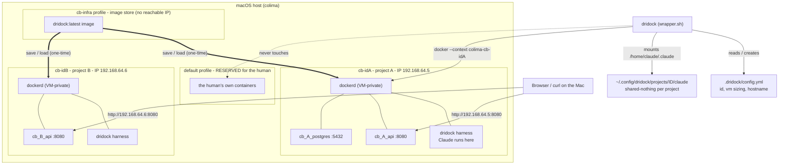
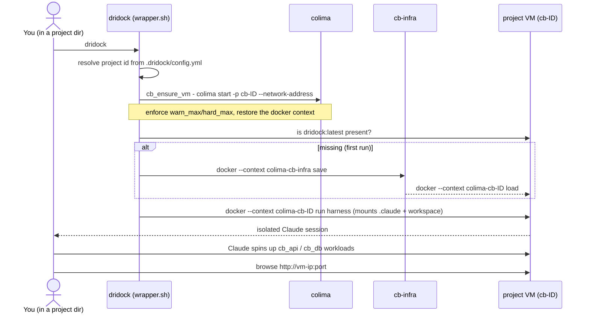

# Design: Per-Project Colima VM Isolation

**Status:** Draft / accepted direction — not yet implemented
**Applies to:** this fork (local-build, Colima-based). See the top-level `CLAUDE.md` for fork intent.

> In 2.x this fork was called `claudebox`; 3.0 renames the host wrapper and harness to `dridock`. The container-side `cb-*` prefix (and `cb-net`, `cb-<id>` profile names) is preserved across 3.0.

## Summary

Give every dridock its **own Colima profile** (a dedicated Lima VM + its own
`dockerd` + its own docker context). Dridock runs *on* that VM and uses *that
same VM's* daemon for everything — both the harness container and any workloads
the inner Claude spins up (test envs, DBs, API servers). Isolation is
**structural**: a dridock can only ever see its own VM's daemon, so Claude
cannot enumerate, `docker rm`, or otherwise touch containers/images belonging to
another project or to the human's default VM.

The macOS **default Colima profile is reserved for the human** and is never
touched by dridock.

## Goals

- A dridock instance cannot affect Docker objects it doesn't own. The boundary
  must not depend on the inner Claude cooperating (it has passwordless sudo and a
  real `docker` CLI, so any in-container convention is bypassable).
- Test workloads the inner Claude launches remain **first-class containers** that
  the human can reach from a browser with normal port publishing.
- No macOS `sudo` at runtime (see [Sudo policy](#sudo-policy)).
- Project identity survives the project directory being moved/renamed on the host.

## Non-goals

- Fine-grained per-object policy within a project's VM. Everything inside a
  project VM belongs to that project; no intra-VM ownership enforcement is needed.
- Sharing one Docker image cache across projects. Each VM has its own cache; this
  is an accepted cost of VM-level isolation (mitigations noted under Gotchas).
- The Layer-1 "socket proxy on a shared daemon" approach. It was considered and
  set aside in favor of the stronger VM boundary. See [Alternatives](#alternatives).

## Background: why not the current model

Today the wrapper mounts the host/Colima `/var/run/docker.sock` into dridock
(Docker-out-of-Docker). All dridocks and any containers they create are
**siblings on the one shared daemon** — they can all see and kill each other, and
the human's containers too. A wrapper script that Claude is "asked" to use for
`docker rm` provides no real protection because the raw socket and CLI are right
there with sudo. The only robust boundaries live *outside* Claude's reach: at the
socket (an authz proxy) or at the daemon (a separate daemon). This design takes
the separate-daemon route, realized as a Colima profile per project.

Nested Docker-in-Docker (sysbox) was also considered but rejected: it seals the
workloads inside the dridock container, which forces a two-hop, statically
mapped port path to reach them from the browser. A per-project VM keeps workloads
as normal containers on a daemon whose ports are reachable from the Mac.

## The model

```
Mac host
├─ colima  (default profile) ................ RESERVED for the human; dridock never touches it
│    └─ the human's own containers
│
├─ colima  cb-7f3ac9e2   ── project A ──   context: colima-cb-7f3ac9e2   IP: 192.168.64.5
│    └─ dockerd (VM-private)
│         ├─ dridock-A              ← the harness container; Claude runs here
│         ├─ cb_A_api      :8080 ── reachable at 192.168.64.5:8080
│         └─ cb_A_postgres :5432
│
└─ colima  cb-1b2c3d4e   ── project B ──   context: colima-cb-1b2c3d4e   IP: 192.168.64.6
     └─ dockerd (VM-private)
          ├─ dridock-B
          └─ cb_B_api      :8080 ── reachable at 192.168.64.6:8080  (no collision with A)
```

**Why the in-container socket mount is unchanged.** Inside every Colima VM the
daemon socket is `/var/run/docker.sock`. Because dridock-A runs *in* VM-A,
mounting `-v /var/run/docker.sock:/var/run/docker.sock` gives it VM-A's own
daemon. Claude's `docker run` then creates **siblings alongside dridock-A in
VM-A**. What changes versus today is only *which VM/context the whole invocation
targets* — not the mount itself.

## Architecture diagrams

**Topology** — one Colima VM per project, the human's `default` VM untouched, and
the image seeded into each project VM from the shared `cb-infra` profile:



**One `dridock` invocation** — identity, VM lifecycle, image seeding, then an
isolated run on the project's own daemon:



## Project identity

Identity must travel with the project directory so moving/renaming it on the host
does not orphan its VM. It is therefore stored in a **marker file**, not derived
from the path.

- File: `.dridock/config.yml` at the project root, field `id` (short hex).
- Profile name: `cb-<id>`. Docker context: `colima-cb-<id>`.
- The `id` is generated once, on first run, and never changed.
- Moving `/Users/alan/projects/foo` → `/Users/alan/work/foo` moves the file with
  it → same `id` → same VM. Rehome-safe.

**Git handling:** `.dridock/config.yml` is **gitignored** (each fresh clone gets
its own VM, which is the sane default). A committed `.dridock/config.sample.yml`
documents the schema (with `id: auto`). On first run the wrapper:

1. creates `.dridock/config.yml` with a generated `id` and the default VM block,
2. writes/refreshes the tracked `.dridock/config.sample.yml`,
3. appends `/.dridock/config.yml` to the project's `.gitignore` (leaving the
   sample tracked).

### Config schema

```yaml
# .dridock/config.yml — generated by dridock; edit to taste. Gitignored.
id: 7f3ac9e2              # stable project identity (do NOT change) → colima profile cb-7f3ac9e2
vm:
  cpu: 4
  memory: 8GiB
  disk: 60GiB
  autostop: false         # stop the VM when the harness container exits (restart is slow)
network:
  hostname: cb-projectA   # optional /etc/hosts alias → the VM's current IP; blank = use raw IP
profiles: [typescript]    # optional opt-in tool bundles; see docs/design/profiles.md
```

Defaults written into the sample: 4 CPU / 8 GiB / 60 GiB, `autostop: false`.

### Per-project `.claude` (shared-nothing)

Each dridock gets its **own** `.claude` state directory — no shared mutable
state between projects. Instead of mounting the host `~/.claude` into every VM,
the wrapper mounts a per-project directory keyed by `id`:

```
~/.config/dridock/projects/<id>/claude   →   /home/claude/.claude
```

It lives under `$HOME` (so Colima auto-mounts it), survives rehome (keyed by the
stable `id`, not the path), and keeps large session/history data out of the
project tree. Sessions, `projects/`, MCP config, skills, init hooks, and cron
history are all per project.

**Auth is the one credential that isn't project state.** It is supplied per
invocation through the existing env path (`ANTHROPIC_API_KEY` /
`CLAUDE_CODE_OAUTH_TOKEN`, or `DRIDOCK_ENV_*`) and written into that project's
`.claude` — so there is still no shared mutable directory, yet you don't re-auth
per project as long as the token is in your environment. `dridock setup-token`
writes into the current project's `.claude`; for multi-project use, prefer
providing the token via env (already the documented path).

**Consequence:** customizations that used to live in the single global `~/.claude`
(custom `bin/` scripts, always-skills, init hooks) are now per project and no
longer apply everywhere automatically. Seed them per project via an init hook or a
machine-wide template (see below) if you want them shared.

## Machine-wide config & VM limits

A host-level config governs machine-wide policy, separate from the per-project
file:

```
~/.config/dridock/config.yml
```

```yaml
# machine-wide dridock settings. The wrapper ships baked-in defaults; this
# file overrides them.
vm:
  warn_max: 3        # warn when this many dridock VMs are already running
  hard_max: 5        # refuse to start a NEW VM beyond this many
  default_cpu: 4     # defaults stamped into a new project's config.yml
  default_memory: 8GiB
  default_disk: 60GiB
data_root: ~/.config/dridock/projects   # where per-project .claude dirs live
```

The wrapper **bakes in defaults** (used when this file is absent) and lets the
file override them. Before starting a *new* project VM it counts running `cb-*`
profiles (never counting `default`): at `warn_max` it warns and proceeds; at
`hard_max` it refuses and points the user at `down` / `destroy`. Because each VM
reserves GiB of RAM, this cap is the guardrail against silently exhausting the
Mac. Default baked-in values: `warn_max: 3`, `hard_max: 5`.

## Colima profile lifecycle

The wrapper runs on the Mac and orchestrates Colima profiles from there (it does
not need the default VM at all).

- **Ensure-up on invocation:** compute `profile=cb-<id>`; `colima status -p
  "$profile"`; if not running, `colima start -p "$profile" --cpu N --memory M
  --disk D` using the project's `config.yml`. First run in a project pays the VM
  boot (~30–60s); later runs reuse the running VM.
- **Mounts at VM creation:** Colima auto-mounts `$HOME`, so projects under `$HOME`
  (and `~/.config/dridock`, `~/.ssh/dridock`) work with the "same path inside
  == host path" trick preserved. A project **outside** `$HOME` needs the workspace
  added to the profile's mounts (`colima start -p … --mount "$PROJECT_ROOT:w"`).
- **New CLI surface** (VMs are heavy, so teardown is explicit):
  | Command | Action |
  |---|---|
  | `dridock` | ensure VM up, run/attach the harness container |
  | `dridock stop` | stop the harness container; **leave the VM running** (fast restart) |
  | `dridock down` | `colima stop -p cb-<id>` (free RAM, keep disk) |
  | `dridock destroy` | `colima delete -p cb-<id>` **+ `limactl disk delete`** (nuke VM + reap its leaked datadisk) |
  | `dridock vm ls` | list dridock VMs; must never display/act on `default` |
  | `dridock vm usage` | per-VM **actual** Mac disk footprint (sparse, so ≠ the max) + any orphaned disks |
  | `dridock vm gc` | reclaim disk: delete orphaned disks + prune dangling (old) images + `fstrim` running cb-* VMs (leaves `default` alone) |
  | `dridock info` (alias `status`) | at-a-glance human summary: versions, config/secrets/data paths, VM + network |
  | `dridock version` | print the host wrapper's semver |
  | `dridock checkversion` | compare the wrapper's semver against the claudebot image's stamp; warn on drift |
  | `dridock ip` (alias `net`) | print the project VM's reachable IP + `/etc/hosts` guidance |

## Running dridock on its VM

Every existing `docker` call in the wrapper gains `--context colima-cb-<id>` so it
targets the project VM. Sketch:

```bash
PROJECT_ROOT="$(git -C "$PWD" rev-parse --show-toplevel 2>/dev/null || echo "$PWD")"
id="$(read_or_init_id "$PROJECT_ROOT/.dridock/config.yml")"
profile="cb-$id"; ctx="colima-$profile"

ensure_vm "$profile" "$PROJECT_ROOT/.dridock/config.yml"   # colima start with sized resources if down
DOCKER=(docker --context "$ctx")

"${DOCKER[@]}" run -it --name "$container_name" "${DOCKER_ARGS[@]}" "$CLAUDE_IMAGE"
```

`DOCKER_ARGS` keeps `-v /var/run/docker.sock:/var/run/docker.sock` and
`-v "$PWD:$PWD"`, but the `.claude` mount changes from the shared host `~/.claude`
to the **per-project** dir: `-v ~/.config/dridock/projects/<id>/claude:/home/claude/.claude`
(see [Per-project `.claude`](#per-project-claude-shared-nothing)).

## Networking

Each project VM gets its **own routable IP**. The wrapper starts project VMs with
`colima start … --network-address`, so a workload that publishes `-p 8080:8080`
binds `0.0.0.0:8080` **inside its VM** and is reachable from the Mac at
`http://<vm-ip>:8080`. `cb-infra` is only an image store and deliberately gets no
reachable IP. `dridock ip` (alias `net`) prints the project VM's IP and browse
guidance; interactive runs print it too.

**Prerequisite — `socket_vmnet` (one-time sudo):** on macOS, a reachable VM IP
(`--network-address`) requires `socket_vmnet`. Without it, Colima falls back to a
sudo-based `vmnet` and **prompts for the password on every VM start**. The fix is a
one-time setup — install `socket_vmnet` (`port install socket_vmnet` /
`brew install socket_vmnet`) and authorize it once:

```bash
limactl sudoers | sudo tee /etc/sudoers.d/lima      # one-time
limactl sudoers --check /etc/sudoers.d/lima
```

`limactl sudoers` auto-detects the binary path (MacPorts `/opt/local/bin` or
Homebrew), so the generated sudoers file is correct either way. After this,
`colima start --network-address` runs with **no password prompt** — verified on the
vz backend. This one-time setup is the sole exception to the runtime no-sudo rule.

Consequences:

- **Distinct VM IP per project = collision-free.** Project A and Project B can both
  publish `:8080` and reach them at their own `192.168.64.x:8080` — no clash. NOTE:
  colima *also* forwards each published port to the Mac's `localhost:<port>` (an
  immediate convenience, like Docker Desktop), and **that** path collides if two
  projects share a port. So the standard is the **VM IP**; treat `localhost:<port>`
  as a single-project-at-a-time fallback, not the reachability model.
- **No port bands, no loopback-alias pool, no LaunchDaemon.** Publish normally;
  address by VM IP.
- **Friendly names, no sudo:** if `network.hostname` is set, the wrapper reads
  `/etc/hosts`, and if the entry is missing/stale it prints a copy-pasteable block
  for the human to add. It never writes `/etc/hosts` itself. Raw VM IP always
  works without this.
- **IP stability:** a recreated VM may get a new IP. The wrapper reads the current
  IP on each start and includes it in the paste-block so the human can update the
  hosts entry if they use one.
- **Reachable-IP startup delay — poll, don't sleep.** The reachable interface
  (`col0` in the VM / vmnet via `bridge100` on the Mac) lags `colima start
  --network-address` by a couple of seconds; the VM reports its address before it's
  actually pingable. There is **no clean "ready" log** to watch — on the vz backend
  colima uses the Virtualization.framework vmnet (no `socket_vmnet` daemon runs, no
  pidfile/log), so the readiness signal is **reachability itself**. Tooling polls
  it (`cb_wait_reachable` pings the VM IP with a bounded timeout; `cb-browser watch`
  polls the noVNC port) instead of fixed-sleeping.

## Sudo policy

No macOS `sudo` **at runtime**. Specifically:

- `/etc/hosts`: read-only from the wrapper; changes are emitted as a paste-block.
- Colima create/start/stop/delete need no runtime sudo — **except** the reachable
  VM IP (`--network-address`), which needs `socket_vmnet`. That is a **one-time**
  passwordless-sudo setup (`limactl sudoers | sudo tee /etc/sudoers.d/lima`, see
  [Networking](#networking)); after it, VM starts prompt for nothing. This one-time
  setup is the only sanctioned sudo.
- `install.sh`: defaults to a **no-sudo** install into a user-writable `PATH` dir
  (`~/.local/bin`); only falls back to `sudo /usr/local/bin` if the user picks a
  root-owned dir.
- When sudo is ever unavoidable, surface it explicitly with the reason; never
  invoke it silently.

## Responsibility split

- **dridock (this project):** owns Colima profile lifecycle, refuses to ever
  touch `default`, runs the harness on the correct VM, wires the socket + mounts,
  manages the `.dridock/config.yml` layer, and emits `/etc/hosts` guidance. The
  security boundary (the VM) lives entirely here and does not depend on the inner
  Claude.
- **A project's Claude (e.g. building Project-A):** uses `docker` normally inside
  its VM; isolation does not depend on it. Naming conventions inside the VM are
  tidiness only, not a boundary.

## Gotchas / edge cases

- **VM boot latency** on first run per project (~30–60s). Communicate it; reuse
  the running VM afterward.
- **Per-VM image cache** → re-pulls/rebuilds across projects, more disk. Optional
  future mitigation: a shared registry mirror or a pull-through cache VM.
- **Previously-global `~/.claude` customizations are now per project.** With
  shared-nothing data dirs, custom `bin/` scripts, always-skills, and init hooks
  no longer apply across all projects automatically — seed them per project (init
  hook or a machine-wide template) if you want them everywhere.
- **Project root detection:** default to `git rev-parse --show-toplevel`, fall
  back to `$PWD` when not a git repo. A non-git project therefore keys its VM at
  whatever dir you first run in — the marker file still makes it rehome-safe.
- **Resource exhaustion:** many projects = many VMs. `dridock vm ls` + explicit
  `down`/`destroy` are the management surface; `autostop` is available per project.
- **`colima delete` leaks the VM's datadisk.** It removes the lima *instance* but
  leaves the per-profile named disk (`~/.config/colima/_lima/_disks/colima-<profile>`,
  up to the whole `disk:` size) behind — so with a VM per project these pile up as GBs
  of dead weight. `cb_vm_destroy` therefore also runs `limactl disk delete
  colima-<profile>` after `colima delete` (limactl refuses an in-use disk, so it can't
  touch a live VM). Disks leaked by *older* dridock versions are reaped by
  **`dridock vm gc`** (or manually: `LIMA_HOME=~/.config/colima/_lima limactl disk
  ls` → delete any row with an empty `IN-USE-BY`).
- **VM disks are sparse and never shrink on their own.** Deleting images/containers
  (or pruning build cache) frees space *inside* the guest, but the host raw disk file
  keeps its high-water mark until the guest issues TRIM. **`dridock vm gc`** fstrims
  every running cb-* VM (on the vz backend the discard passes through to the sparse
  file — e.g. an image-store VM went 39G→8.4G on the Mac); `dridock vm usage` shows
  the actual footprint. Run `gc` periodically or after large deletes. (`default` is
  the human's VM and is left untouched — trim it yourself with
  `colima ssh -p default -- sudo fstrim -av`.)
- **File ownership / UID-matching is a no-op under Colima.** The entrypoint's
  Linux-style UID/GID matching (adjust the `claude` user to the workspace owner so
  Claude's files aren't root/`1000`-owned on the host) is unnecessary here: Colima's
  virtiofs mount maps *every* container-side write back to the host user regardless
  of the in-container UID, so files Claude creates always come back owned by you.
  The entrypoint stats the mounted workspace, sees root (`0`), and correctly skips
  matching. Tests assert the real invariant (host-side ownership round-trip), not
  the Linux UID-matching mechanism. (Verified: a file created by a root process in
  a bind-mounted dir shows up owned by the host user `501` on the Mac.)

## Alternatives considered

- **Shared daemon + socket authz proxy (Layer 1):** keep one daemon; a proxy
  stamps an owner label on creates and denies destructive ops on non-owned
  objects. Lighter (shared image cache, no VM overhead) and browser-friendly, but
  the boundary is policy code rather than a VM. Set aside in favor of the stronger,
  simpler-to-reason-about VM boundary. Kept in back pocket if VM overhead hurts.
- **Nested DinD (sysbox):** strongest self-containment but two-hop, statically
  mapped inbound networking; rejected for the browser-access requirement.
- **Naming convention + wrapper only:** no real enforcement (bypassable with
  sudo). Rejected as a security boundary.

## Testing

The bash test suite runs against a **dedicated throwaway Colima profile** (e.g.
`cb-test-<pid>`), created in `setup()` and deleted in `cleanup()`. This keeps
tests off both the human's `default` VM and any real project VMs. Booting a VM per
run is slow, so the profile is created once per `test.sh` invocation and reused
across the tests in that run, then destroyed. Tests build the local image into and
run all `docker`/`colima` calls against that throwaway profile's context.

## Phased implementation plan

1. **Config layer** — per-project `.dridock/config.yml` read/init, `id`
   generation, `config.sample.yml` emission, `.gitignore` update; machine-wide
   `~/.config/dridock/config.yml` read with baked-in defaults. Pure host-side;
   no Docker changes yet. Unit-testable in isolation.
2. **Profile lifecycle** — `ensure_vm`, resource sizing from config, `warn_max` /
   `hard_max` enforcement, and the `stop` / `down` / `destroy` / `vm ls`
   subcommands, with a hard guard that `default` is never targeted.
3. **Per-project data dir** — mount `~/.config/dridock/projects/<id>/claude`
   instead of the shared `~/.claude`; move the per-container auth/args sidecar
   files into it.
4. **Context threading** — add `--context colima-cb-<id>` to every `docker`
   invocation in `wrapper.sh` (interactive run/start, `_prog`, `_cron`,
   passthrough `-v/doctor/mcp`, busy-check `ps`). Docker mounts otherwise unchanged.
5. **Networking ergonomics** — read VM IP, `/etc/hosts` paste-block for
   `network.hostname`, docs for browsing workloads by VM IP/name.
6. **No-sudo install** — `install.sh` defaults to `~/.local/bin`.
7. **Docs + tests** — update README/mode docs for the VM model; migrate the bash
   suite to the dedicated throwaway profile described in [Testing](#testing).

## Resolved during design

- Per-project `.claude` — **shared-nothing** (per-project data dir), not the
  shared global dir.
- VM count — machine-wide `warn_max` / `hard_max` in `~/.config/dridock/config.yml`
  with baked-in defaults.
- Test suite — runs against a **dedicated throwaway Colima profile**.

## See also

- [versioning.md](../versioning.md) — `version` / `checkversion` and host↔image drift.
- [multi-repo-projects.md](multi-repo-projects.md) — one project/VM spanning several repos.
- [bootstrap.md](bootstrap.md) — scaffolding a project onto a VM.
- [browser-testing.md](browser-testing.md) — reaching workloads by VM IP / `cb-net`.
- [environment-variables.md](../environment-variables.md) — data dir, image, and VM knobs.
